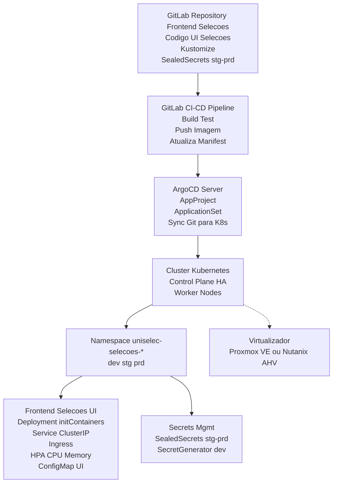

Repositórios no gitlab:

    API:

        git clone http://dti-gitlab.unilab.edu.br/dti/uniselecapi.git

    Página do Candidato:

        git clone http://dti-gitlab.unilab.edu.br/dti/uniselecwebsite.git

    Página do administrador:

        http://dti-gitlab.unilab.edu.br/dti/uniselecadminpage.git


Links - Ideal:

    Página do candidato:

        Produção:

            https://uniselec.unilab.edu.br

        Homologação:

            https://uniselec-staging.unilab.edu.br

    Página do Administrador:

        Produção:

            https://uniselec-admin.unilab.edu.br

        Homologação:

            https://uniselec-admin-staging.unilab.edu.br

    API:

        Produção:

            https://uniselec-api.unilab.edu.br

        Homologação:

            https://uniselec-api-staging.unilab.edu.br


O que eu consigo fazer em pouco tempo:


    Página do Candidato:

        Homologação:

            https://uniselec-staging.jefponte.com

        Produção:

            https://uniselec.jefponte.com

        Produção (Link alternativo, serviço gratuito do Firebase):

            https://uniselec.web.app


    Página do administrador:

        Homologação:

            https://uniselec-admin-staging.jefponte.com

        Produção:

            https://uniselec-admin.jefponte.com

        Produção (Link alternativo, serviço gratuito do Firebase):


            https://uniselec-unilab-admin.web.app

    API:

            https://uniselec-api.jefponte.com

            https://uniselec-api-staging.jefponte.com


Em produção o .env, na variável VITE_API_URL deve conter o link de produção da API.


# gera SALT e HASH via Node
node -e "const c=require('crypto'); const salt=c.randomBytes(16); c.pbkdf2('SUA_SENHA_FORTE', salt, 120000, 32, 'sha256', (e,k)=>{if(e)throw e; console.log('SALT_BASE64='+salt.toString('base64')); console.log('HASH_BASE64='+k.toString('base64'));})"

### Arquitetura da solução


## Segredos (Sealed Secrets)
```sh
kubectl apply -f https://github.com/bitnami-labs/sealed-secrets/releases/download/v0.33.1/controller.yaml
kubeseal -f regcred-secret.yaml -w base/sealed-secret-regcred.yaml --scope cluster-wide
kubeseal --validate < base/sealed-secret-regcred.yaml
```
### Desprovisionar Deploy
```sh
argocd login argocd.unilab.edu.br --username admin --password "pass" --grpc-web
argocd app list
kubectl -n argocd patch applicationset uniselec-selecoes-dev-as --type='merge' -p '{"spec":{"generators":[{"list":{"elements":[]}}]}}'
argocd app list | grep uniselec-selecoes-dev
```

### Re-Provisionar Deproy
```text
┌───────────────────────────────────────────────────────────────────────────┐
│                       Inital Pipeline Execution Flow                      │
└───────────────────────────────────────────────────────────────────────────┘
┌──────────────┐  ┌───────────┐  ┌──────────┐  ┌──────────┐  ┌──────────────┐
│   validate   │─>│   tests   │─>│  build   │─>│ staging  │─>│ notification │
└──────────────┘  └───────────┘  └──────────┘  └──────────┘  └──────────────┘
│                 │              │             │             │
├─ docker         ├─ dependency  └─ docker     └─ deploy     └─ staging
├─ environment    ├─ sast_scan                 (re-run aqui)
└─ kustomize      ├─ sonarqube
                  └─ unit
```
**Ação necessária**: Rodar o Job `staging` da Pipeline GitLab CI/CD GitOps


Try pipeline